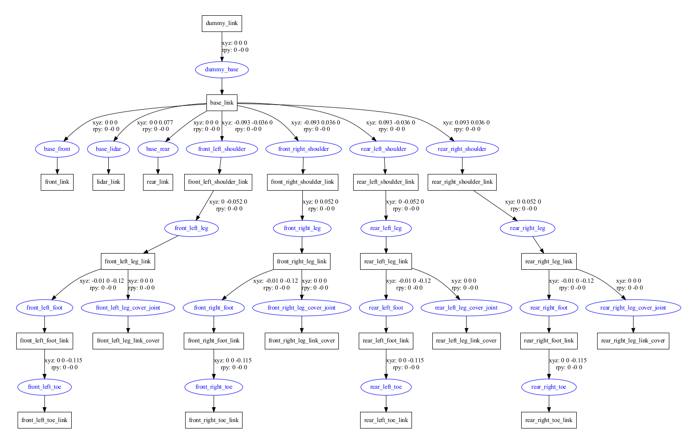
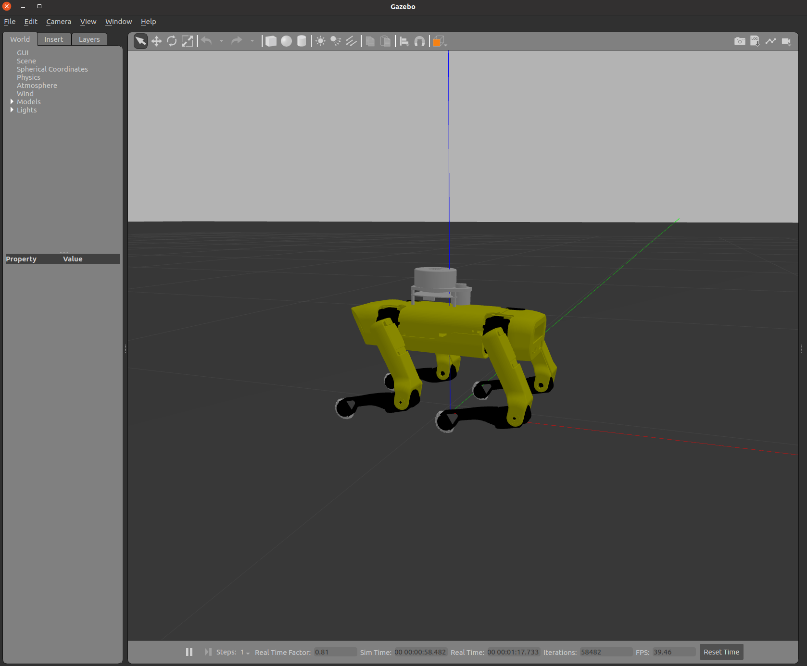
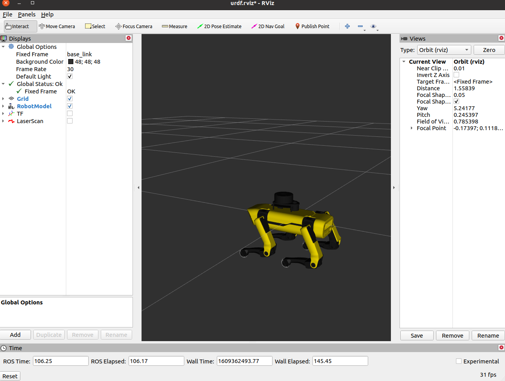

# Introduction 

This is the repository for simulation code of SpotMicroAI project in ROS.

The SpotMicroAI project is designed to be a low cost, easily built quadruped robot. The design is roughly based off of Boston Dynamics quadruped robot SpotMini, though with obvious adaptations such as size and sensor suite.

For the details of SpotMicroAI, please refer to the project documentation at: [https://spotmicroai.readthedocs.io/en/latest/](https://spotmicroai.readthedocs.io/en/latest/). 

## Robot design

The brain of this project is designed to be powered by a Raspberry Pi 4. The Pi is connected to a PCA9685 controller board which allows communication to the 12 servos required to articulate the hips and legs. Sensors include a raspberry pi camera, MPU6050 Gyro accelerometer combination, and several ultrasound sensors. Some users have also integrated a RPiLIDAR A1 into their build.

The structure of the robot is organised as below:


# Usage 

Clone the codes

```bash
git clone https://github.com/sulibo/spotmicro.git
```

Build the ROS packages

```bash
cd spotmicro
catkin build
source ./devel/setup.bash
```

Display SpotMicro in Gazebo and Rviz 
```bash
roslaunch spotmicro_description spotmicro_display.launch
```

The SpotMicro will be spawned and displayed in Gazebo and Rviz. 






# References 

This repository is built based on Florian Wilk and Joel Martinez's simulation repositories which can be found at [here](https://gitlab.com/custom_robots/spotmicroai/simulation/-/tree/master/)
